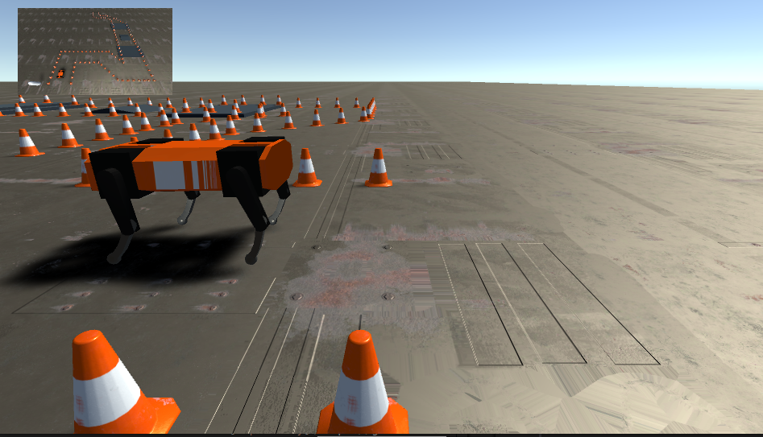
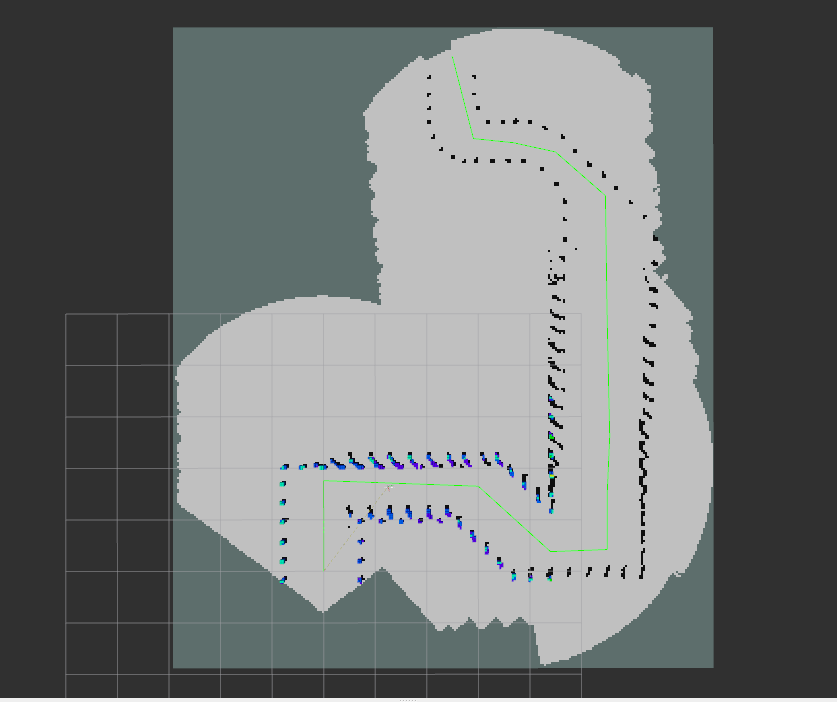
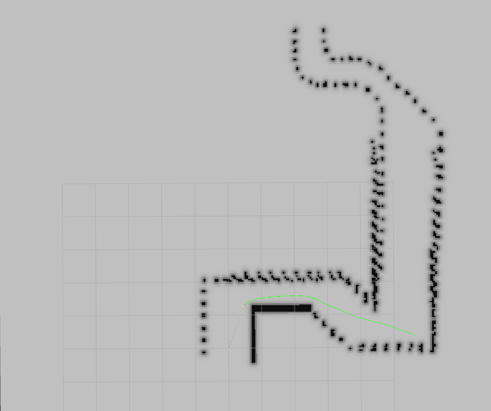
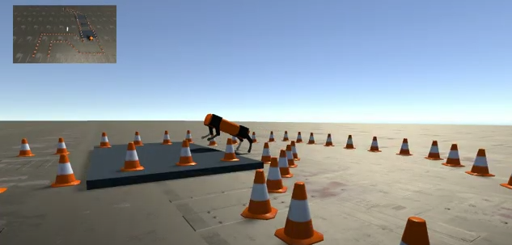

# AutonomousQuadruped Project 🤖

## Table of Contents 📚
1. [Introduction](#introduction)
2. [Features](#features)
3. [Installation](#installation)
4. [Usage](#usage)
5. [Components](#components)
6. [Contributing](#contributing)
7. [Contact](#contact)

## Introduction 📝
AutonomousQuadruped is a project focused on developing a quadruped robot capable of navigating complex environments autonomously. This is a course project for Introduction to ROS. It leverages advanced technologies in perception, path planning, and control systems to achieve robust and coordinated motion.



The details about this course you can find in following website:
https://www.moodle.tum.de/course/info.php?id=88252&lang=en

## Features ⭐
In this project, we have already completed:
- ✅ **Perception Pipeline**
- 🛤️ **Path Planning**
- 📈 **Trajectory Planning**
- 🔄 **Coordinated Motion Planning**
- 🚧 **Obstacle Navigation**
- 🎛️ **PID Control Integration**

**You can find the result below: (Please click it!)**

<a href="https://www.youtube.com/watch?v=6ABGK-RzElg">
  
</a>

- **Offline Control Completion Time:** 7 minutes 5 seconds 🎉😄
- **Online Control Completion Time:** 7 minutes 18 seconds 🎉😊

## Installation ⚙️
### 1. Download the project 💾

1. Git clone the code from our [repository](https://gitlab.lrz.de/00000000014B649F/autonomous_quadruped.git).
2. Run 
   ```
   cd ~/autonomous_quadruped
   ```

### 2. Download the external ROS package 📦
1. To install the external ROS packages, please run the following commands:
   ```
   chmod +x install_ros_packages.sh
   sudo ./install_ros_packages.sh
   ```

2. Run 
   ```
   catkin build
   ```
3. Download Quadruped.zip from this [link](https://syncandshare.lrz.de/getlink/fiLvgiTXetubiN1i4PRjuR/).
4. Unzip the Unity file and copy the files to autonomous_quadruped/devel/lib/simulation/
5. Run 
   ```
   cd PATH/TO/autonomous_quadruped/devel/lib/simulation
   ```
   ```
   chmod +x RoboDog_Build.x86_64
   ```


## Usage 🎮
To use this package, follow the steps below:

1. **Launch the simulation** 🚀

   Setup up your ROS Environment
   ```
   source /devel/setup.bash
   ```
   Controller: 
   
      1)Offline Results: This version uses the controller_node with PID control. It evaluates the performance of the basic controller settings.

      run 
      ```
      roslaunch simulation simulation_offline.launch
      ```
      2)Online Results: This version uses the controller_node without PID control. It assesses the improved performance with real-time PID adjustments.

      run 
      ```
      roslaunch simulation simulation_online.launch
      ```
   If you want to change the controller, please change the launch file to
    ```
    <node pkg="controller_pkg" type="controller_node_PID" name="controller_node_PID" output="screen" />
    ```
   or to
   ```
   <node pkg="controller_pkg" type="controller_node_PID" name="controller_node" output="screen" />
   ```


2. **Monitor and adjust parameters** 🛠️
   - Use provided tools to monitor the robot's performance and adjust parameters for optimal behavior.

## Components 🧩
### Perception
- Uses sensors and algorithms to understand the environment.

### Path Planning
- Offline and online strategies for navigating the environment.

<p align="center">
  
  
</p>

### Trajectory Planning
- Generates smooth and feasible movement paths.

### Coordinated Motion Planning
- Ensures synchronized and coordinated movements.

### Obstacle Navigation
- Capabilities to navigate and overcome obstacles.

<p align="center">
  <br>
  <b>Obstacle Example</b>
</p>

### PID Control Integration
- Implements precise control mechanisms for stability.

## Contributing 🤝
- **Perception**: Yue Zhang
- **Planning**:
  - **Offline Path Planning**: Guangyan Wu
  - **Offline Trajectory Generation**: Mengfei Fan
  - **Online Path Planning and Trajectory Generation**: Yue Zhang
- **Control**:
  - **Offline Controller and Online Controller**: Mengfei Fan
  - **Offline Controller and PID Control**: Xinlong Wang

We welcome contributions to improve this project. To contribute, please follow these steps:

1. **Fork the Repository** 🔄: Start by forking the project repository to your GitHub account.
2. **Create a Branch** 🌿: Create a new branch for your feature or bug fix.
3. **Make Changes** 🛠️: Implement your changes and ensure they adhere to the project’s coding standards.
4. **Commit Your Changes** 💾: Write a clear and descriptive commit message for your changes.
5. **Submit a Pull Request** 📬: Submit a pull request to the main repository. Please include a detailed description of your changes and any related issue numbers.

For more detailed guidelines, please refer to the `CONTRIBUTING.md` file in the repository.

## Contact 📧
For more information, please contact:

- **Zhang, Yue**: yue22.zhang@tum.de
- **Fan, Mengfei**: ge85red@mytum.de
- **Wang, Xinlong**: ge89yah@mytum.de
- **Wu, Guangyan**: ge92dam@mytum.de
